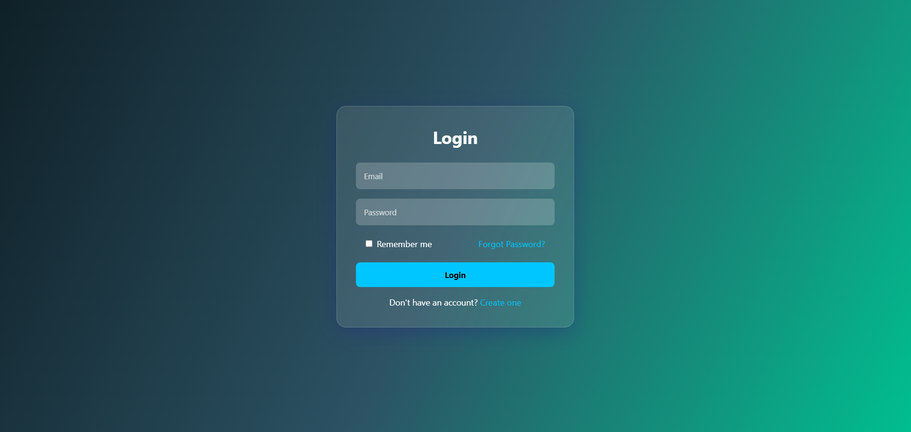
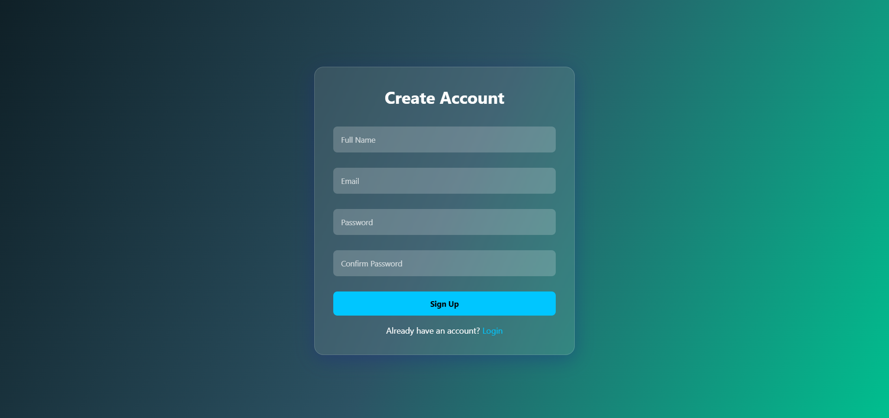
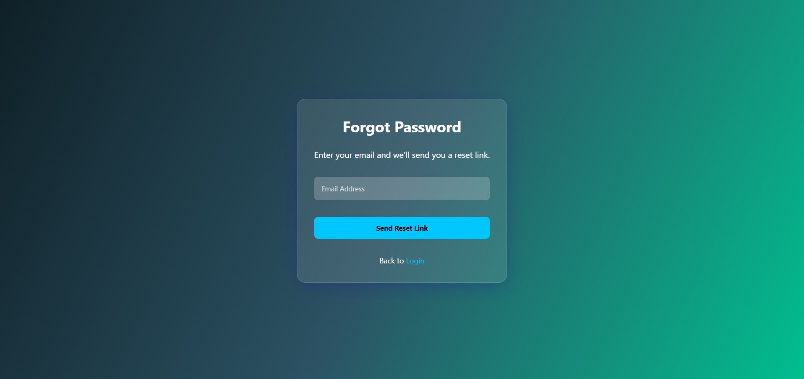

# Responsive Login UI

A simple, responsive login/signup/forgot-password page built using HTML and CSS.  
Includes a modern dark theme with glassmorphism style.

## 📱 Features
- Responsive layout (mobile & desktop)
- Glassmorphism styling
- Dark gradient background
- “Remember me” and “Forgot password?” functionality (UI only)

## 💻 Preview Screens

### 🔐 Login Page


### 📝 Signup Page


### ❓ Forgot Password Page


## 🔧 Tech Used
- HTML5
- CSS3 (Flexbox, media queries)

## 📂 Folder Structure
```
responsive-login-ui/
├── index.html
├── signup.html
├── forget_password.html
├── style.css
├── screenshot-login.png
├── screenshot-signup.png
├── screenshot-forgot.png
└── README.md
```

